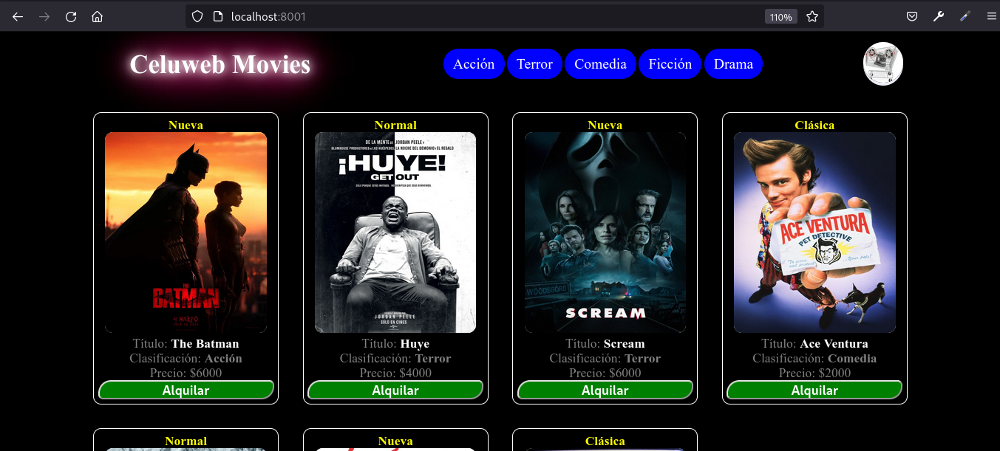

# Celuweb Movies

## _Aplicación para el alquiler de películas._



El entorno de de desarrollo para este proyecto: _docker con PHP v7.1.3-fpm, MariaDB v10.3.9 y nginx en su última versión; todos en contenedores independientes._

## Inicio

Sólo se necesia de [docker](https://www.docker.com/) instalado en la máquina.

Para Linux: _abrir una terminal en el directorio del proyecto y ejecutar:_

```
docker network create php-network || true

docker-compose up -d

docker exec -it celuweb_database sh -c "mysql -uroot -proot celuweb_database < /var/lib/mysql/db_tables_definition.sql"
```

Para cerrar el entono

```
docker-compose down
docker network rm php-network || true
```

Opcionalmente:

```
make run
```
Este comando creará una red docker y desplegará de forma automática el entorno; debe tener instalado [make](https://www.gnu.org/software/make/)

Para cerrar el entono eliminando la red creada:

```
make down
```

Luego, abrir el navegador y tipear en la barra de direcciones **http://localhost:8001/**

__________________________
__________________________

## Autor

* **Andrés E. Restrepo F.** - *This project* :  [celuweb-movies](https://github.com/andres613/celuweb-movies)
